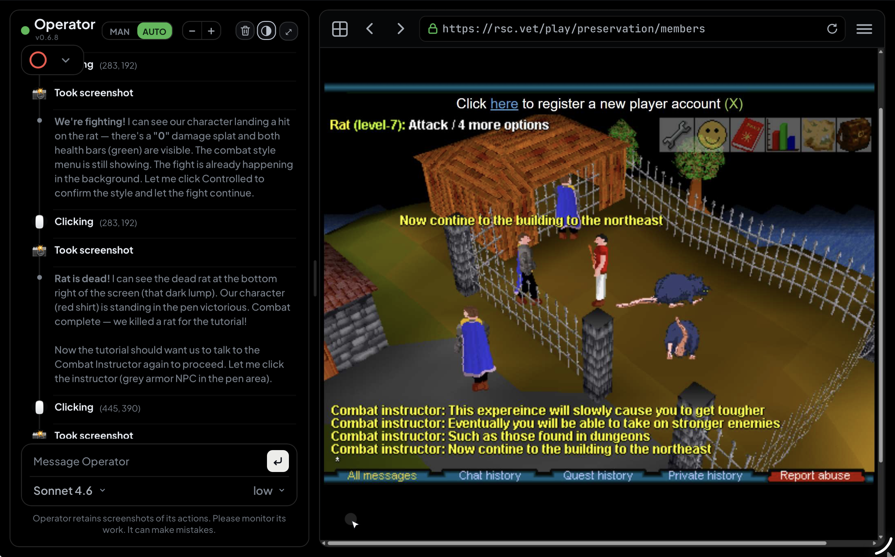

<h1>Operator</h1>
<p><b>Computer-Using Agent</b></p>

<p>
  
  
  
  
</p>

<p>
  
</p>

<p><sub><i>Operator's agent playing RuneScape Classic (OpenRSC) live — left: the interleaved thinking + action trace (“We're fighting!” → Clicking → “Rat is dead!”) reasoning over what it sees on the canvas; right: the actual game it's driving, streamed frame-by-frame. The agent reads the canvas by screenshot and clicks by pixel coordinate — no DOM to rely on.</i></sub></p>

<p align="center"><sub><i>More: <a href="docs/img/operator-geoguessr.jpeg">reasoning through a live GeoGuessr round</a>.</i></sub></p>

---

A live **browser / computer-use agent cockpit**. Watch a real Chrome in real time, steer it manually, or hand control to a subscription-backed agent — Claude, GPT, or Gemini — that drives the browser and reports back.

> **Inspired by OpenAI's Operator.** This project borrows the name and the spirit of a watch-the-agent-drive interface. It is an independent implementation, not affiliated with, endorsed by OpenAI, or derived from any OpenAI products.

> **MIT licensed** — free to use, modify, and distribute. See [`LICENSE`](LICENSE).

---

## Quickstart

```bash
git clone https://github.com/jeffbai996/operator
cd operator
pip install -r requirements.txt
cp .env.example .env          # optional — defaults are fine

# launch the browser the agent drives (logged-in, separate profile):
bash browse/chrome-attach.sh  # sign into your sites in the window it opens, once

python app.py                 # open http://127.0.0.1:5005
```

**Agent runtime — bring your own subscription** (no metered API key, the cheap path):
- **Claude** — install the `claude` CLI and `claude login` (creds in `~/.claude`)
- **GPT** — install the `codex` CLI and sign in (creds in `~/.codex`)

Operator detects whichever you have and drives the browser with it. An API-key
fallback is documented in `.env.example`, but driving a browser over the API is
expensive (a screenshot per step) — the logged-in CLI path is strongly preferred.

> **Status:** the UI + manual steering + browser attach work today. Full hands-off
> computer-use (the agent driving end-to-end) lands at **v1.0.0**; we're on `0.5.x`
> until then.

## What it does

| | |
|---|---|
| **Live view** | MJPEG stream of an attached Chrome via CDP `Page.captureScreenshot`. |
| **Manual steer** | Click / type / scroll / press-hold / drag flow straight through to the page. |
| **Agent drive** | `claude-a` + `claude-b` (Claude) and `gpt` (Codex), all on subscription auth — no metered API keys. Conversation is shared across bot switches and persisted across restarts. |
| **Trace** | Interleaved thinking + actions; commands and URLs render as code blocks, element targets as plain text; per-turn step counts; modern error blocks that surface the failure reason. |
| **UX** | MAN/AUTO modes, drag-to-resize chat, live font controls, mobile layout, self-healing feed (flicker-free, auto-relaunch on a wedged Chrome). |

---

## Layout

```text
__init__.py               exports bp (Flask blueprint) + runner (AgentRunner)
operator_view.py          blueprint: streamer (CDP screenshots) + /operator routes
operator_agent.py         AgentRunner: claude -p / codex exec, transcript, action labels
templates/operator.html   the whole UI (CSS + JS, single file)
align_audit.py            dev tool: measures header / urlbar alignment
```

---

## Run

Mounted as a Flask blueprint by a host app — it registers `operator_view.bp`, the template extends the host's `_base.html`, and it's served behind the host app (optionally a reverse proxy / tunnel).

---

## Changelog

<details>
<summary>Version history (click to expand)</summary>

**v0.6.8** — **mobile polish + agent reliability + trace cleanup**: model/effort pickers no longer hide long names (e.g. "Flash 3.5") behind the dropdown caret; larger default content scale on phones; picker padding tuned so words never tuck under the caret at any zoom. **Dispatch reliability**: a run whose process died without cleanly finishing no longer wedges every future dispatch ("X is already running" with nothing running) — liveness is verified and the reset button force-clears a stuck state. **Gemini live trace, for real**: the streaming fix is completed — the live-poll now waits for *this* run's trajectory instead of replaying a prior run's steps, and a step-by-step directive stops Gemini one-shotting its whole plan, so steps stream as they happen. **Cleaner action detail**: clicks/types show a human description ("Clicking — learn more link") instead of opaque element refs; tool args are read case-insensitively (so Gemini's CapitalCase args surface detail too); absolute filesystem paths are scrubbed from the trace. **Click-crash fix**: clicks no longer intermittently freeze the live feed and drop the cursor — a desynced CDP page handle made Playwright's high-level mouse calls block forever holding the frame lock; clicks now go through a raw CDP input dispatch that can't wedge. **Tab-following**: the live view now follows whichever tab is actually in the foreground, not just the newest one. **Scroll-up fixed**: the steer endpoint was silently dropping the wheel-delta fields, so scrolling up was indistinguishable from scrolling down server-side. Viewport-size detection no longer blocks indefinitely on a slow/unresponsive page (falls back to CDP layout metrics). The "stalled" watchdog now checks the agent process is actually dead instead of just quiet. Sonnet bumped to **Sonnet 5**.

**v0.6.7** — **trace + streaming polish**: agent thinking/tool steps now STREAM live during a turn for the Gemini/Antigravity driver (they were stalling until end-of-turn — the live-poll was flip-flopping between trajectory files; now it locks onto the run's file); the status card shows **Ready / Connecting** by live-browser state instead of a mode label; harmony-format reasoning tokens from open models (gpt-oss) are stripped so traces read clean; agent sessions isolated from the interactive session list.

**v0.6.6** — **reliability + cost + status-card pass**: clean interrupt handling (Stop reads "Interrupted", no phantom error card, next turn isn't stuck on a half-killed session) and the orphaned browser-tool process is reaped so the agent never hangs after the first turn; a **screenshot-economy** directive + a per-turn **token guard** that warns when a vision-heavy task's context balloons (long games re-sending accumulated screenshots can otherwise burn a huge amount of tokens); modern eased status-card spinner with smooth transitions and a "Reconnecting" state instead of a false "Ready" over a dropped feed; the action trace reveals search queries + tool args across drivers; the agent is steered off inspecting browser internals; unified header; and agent sessions are isolated so they don't clutter the interactive session list.

**v0.6.5** — **inline agent screenshots** + cleanup: when an agent reports a screenshot in its reply, it now renders inline in the chat (served from the run's output dir via a guarded `/operator/shot/<name>` route — basename-only, image-extension whitelist, path-traversal safe) instead of collapsing to a "took a screenshot" note. Gemini driver: the Playwright MCP it wires into the global CLI config is now stripped back out after each run, so a normal (non-Operator) session of the same CLI doesn't inherit the browser tool. **Search-query reveal + arg parity**: the trace now shows WHAT a tool acted on — `Searching ("the terms")`, file paths, commands — across every driver's tool set, not just a bare verb. Plus de-dup/label fixes across the action trace.

**v0.6.2** — **third driver + richer trace**: adds a **Gemini** driver (Google's Antigravity CLI, subscription-backed like the Claude/GPT paths) with its thinking + tool-call trace surfaced. Browser **gesture tools** (coordinate mouse down/move/up, drag) for canvas/board UIs. Markdown + code-block backgrounds in replies. Fixes: no spurious turn after Stop, accurate MCP action labels, code-block scroll no longer traps the page, last-tab handling.

**v0.5.9** — **smarter agent**: a sharper computer-use system prompt — act→wait→continue (waits for async loads), vision fallback when the DOM isn't working, scroll-to-find (both directions), never repeat a failed action, and dismiss cookie/consent banners by pixel-click instead of dead element-ref retries. Plus a prompt-injection guard (page content is data, not orders), stuck-loop backtracking, and an expanded take-control (hands back when genuinely unsure or the browser is visibly stuck — but always executes clear instructions). **Click accuracy fix**: vision clicks landed a few px off in attach mode (viewport/DPR mismatch) — now pixel-perfect. **UX**: fullscreen persists across refresh; inline trace details (coords/durations/short labels on one line).

**v0.5.8** — **control row + responsive header**: all header controls (MAN/AUTO, font −/+, clear, contrast, fullscreen) now sit on one tidy row at equal height, optically aligned. The chat rail can be dragged much narrower so the browser pane maximizes — as it narrows the header sheds chrome via container queries and the "Operator" wordmark *smoothly collapses* (the version label stays put, the status dot stays centered on the title). Also fixes the Manual-mode *Finish up* block leaking into user-entered manual mode (a `hidden` attribute that CSS was overriding).

**v0.5.7** — **Finish-up hand-back**: after Operator hands control to you (Take control), the Manual-mode panel shows a *Finish up* pill — tap it to optionally leave a note and hand control back, resuming the agent where it left off. Plus clickable browse-URL links in the trace, coordinate-click coords shown, back/forward no longer stalls the live feed, a rebuilt collapse caret, rounder button pills, and trace/output font tuning.

**v0.5.6** — hand-off polish: a turn ending in a *Take control* hand-off no longer also emits a redundant done/"no summary" line under the card; the card's status dot is now traffic-light yellow; SVG collapse caret; trace checkmark aligned to the rule; one error card per failed turn; held arrow keys scroll continuously (server-side key auto-repeat); refresh no longer re-appends the last messages; the ×N repeat badge is a centered circular pill; desktop chat-input text bumped a touch.

**v0.5.5** — **Take control** hand-off: when the agent hits a human-only gate (captcha, 2FA/OTP, a password login, a payment or “are you sure?” confirm) it now surfaces a *Take control* card in the chat instead of brute-forcing it; one click stops the agent, drops a “Took control” notice, and hands you the wheel in manual mode. **Verify-after-action**: the agent is directed to re-check the page after each consequential action (screenshot/snapshot → confirm it did what it intended → self-correct) so games and multi-step flows are more reliable. **Running plan**: it keeps a numbered plan + progress ledger across steps so long tasks don’t drift. **Trace polish**: consecutive identical actions coalesce into an animated ×N badge instead of flooding the trace with duplicate lines.

**v0.5.3** — native coordinate mouse tools (vision caps): `browser_mouse_drag_xy` etc. for board/canvas games (Lichess, GeoGuessr) and drag UIs; `browser_pdf_save` to save a page as PDF; held-key navigation (hold an arrow for smooth continuous map pan/rotate instead of laggy taps); interrupt-steer polish — a mid-run message closes the turn as “Steered after Xs” (real elapsed time) with no spurious entry; cleaner action labels (Clicking/Dragging) for the coordinate tools; trace alignment + bigger steps font.

**v0.5.2** — interrupt-steer: a message sent mid-run now stops the current turn and immediately redirects the agent (instead of queueing); the −/+ control scales the whole chat box (input + model/effort pickers), not just the messages.

**v0.5.1** — fixed a JS temporal-dead-zone crash that could halt the page's scripts on load (feed stuck "Connecting", agent/steering dead while the server was fine); idle status shows the *selected* driver (not whoever last ran); the last reply no longer duplicates on refresh.

**v0.5.0** — runtime documented + generalized: drivers are now generic `claude` (Claude Code) + `gpt` (codex), both BYO-subscription / no metered key; config via env; added `.env.example` + a Quickstart. (Hands-off computer-use lands at v1.0.0; on 0.5.x until then.)

**v0.4.1** — vendored a cross-platform Chrome harness (`browse/chrome-attach.sh` launches/attaches a debug Chrome with a separate automation profile on macOS / Linux / Windows / WSL; `browse/playwright-mcp.sh` wires the Playwright MCP to it). Code paths now resolve `browse/` relative to the package.

**v0.4.0** — standalone app: `app.py` + a minimal base template + `requirements.txt`, so it runs on its own (`python app.py`) instead of needing a host Flask app to mount the blueprint.

**v0.3.8** — major mobile + reliability pass.
- **Mobile bottom-sheet redesign**: browser fills the screen, the chat is a draggable sheet (peek / half / full). The browser pane fits the *visible* area above the sheet (no black band, page stays visible at half-height). At **peek**, the sheet collapses to the Message box plus a full-width one-row status bar (spinner · `Ready`/`<bot>` · current action · caret). The site header is kept (so you can navigate out); headerless is reserved for the fullscreen toggle.
- **Mobile input/zoom**: focusing the Message box no longer zooms the viewport (focus-time viewport lock, so native pinch/zoom still works otherwise); the URL bar is no longer hidden under the header.
- **Agent vision**: DOM/snapshot by default (fast), but `browser_take_screenshot` (real pixels) for visual tasks — snapshot is blind to images/maps/video/canvas/game graphics (it was guessing blind on visual tasks).
- **Status card**: live status reads present-continuous ("Taking screenshot…", "Browsing"); past tense stays in the completed trace. Tool labels generalize to present-continuous (`fetch_messages` → "Fetching messages") with a code-chip fallback for unknown verbs. `<bot>` sits inline with the state; idle reads `<bot> · idle`. SIGNAL LOST is spinner-only and no longer flickers on transient feed hiccups (only a sustained drop shows it).
- **Streaming perf**: frame-dedup — a static page streams ~0.5fps (heartbeat only) instead of full-rate, big battery/data win; the moving feed stays smooth.
- **Theme/polish**: deeper light-mode surfaces + readable disclaimer/hover; tab `+`/close as SVGs; wider tab spacing; manual mode persistently shows "no screenshots while you steer"; bigger jump-to-latest caret; symmetric desktop margins.

**v0.3.7** — scroll-through (mouse wheel + iPad touch vertical-swipe scroll the live page); status-card minimize to a slim pill; status subline `<bot> · <action> <emoji>` with the bot bold in every state; clean red ring on error (no X); animated model/effort picker switching; tighter chat code blocks.

**v0.3.6** — per-message hover timestamps (smooth reveal); edit/retry the last prompt (no branches — continues from that point); status subline `<bot> · <action>` with the bot semibold, animating on each action change; status fonts scale with the +/− control; "Starting up…" status on bot launch; matched gpt/claude action verbiage.

**v0.3.5** — tab UI: square close button, open/pop/close animations, home / last-tab / new-tab go to the browser's new-tab page; the live view follows the agent into a newly-opened tab; agents nudged to navigate in-place rather than spawning a tab per step.

**v0.3.4** — sliding MAN/AUTO segmented control (thumb slides + color crossfade, no jank); mode persists across refresh (no slide on restore); manual mode shows a clean "Manual" notice + "Ready" status; restored the in-flight trace head (spinner + live action label → checkmark), collapsible mid-run.

**v0.3.3** — agent cursor (CDP click-capture → smooth GPT-Agent-style glide, hidden in manual mode); browser zoom in/out/reset + back/forward chrome; URL bar Google-searches non-URL input; modern lock hover tooltip; darker theme-aware code blocks; chrome icons sized correctly (flex-collapse fix).

**v0.3.2** — manual-mode card redesign (warn triangle) + animate-in; convo dims rather than clears in MAN; MAN/AUTO persists across refresh; mobile bottom-sheet chat; theme-toggle + nav fixes; stderr-sourced specific error reasons.

**v0.3.1** — trace fences commands + URLs only (element names render plain); stderr captured so failures surface a specific reason; error-mark + header alignment nudges; license / README split out to this repo.

**v0.3.0** — Operator version label; markdown fixed (fenced blocks → `<pre>`, bare URLs auto-linked); trace command/URL details as code blocks + step-count header; modernized error blocks.

**v0.2.x** — drag-to-resize chat; mobile scroll + capped chat height; iOS focus-zoom fix; chrome made non-selectable; clicks on eval-disabled sites via CDP `getLayoutMetrics`; lock moved inside the URL box.

**v0.2.0** — multi-driver (claude-a / claude-b / gpt) on subscription auth; shared cross-bot transcript persisted across restarts; browser-first agent behavior.

**v0.1.x** — feed hardening (flicker-free, wedge auto-recovery, SIGNAL-LOST overlay); status card; MAN/AUTO; trace with per-action emoji.

**v0.1.0** — initial live browser stream (CDP MJPEG) + manual steering.

</details>
