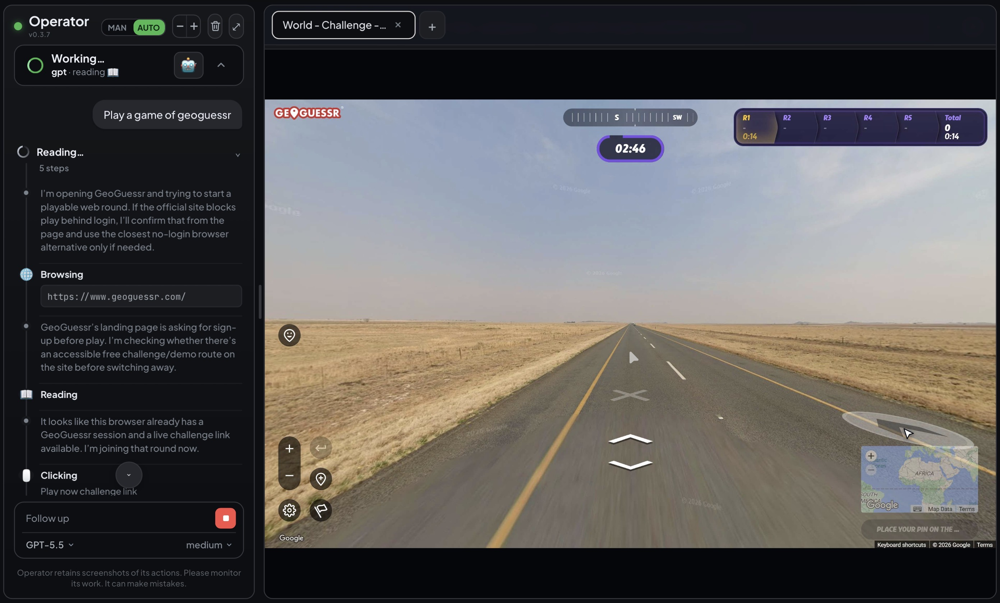

<h1 align="center">Operator</h1>
<p align="center"><b>Computer-Using Agent</b></p>

<p align="center">
  
  
  
  
  
</p>

<p align="center">
  
</p>

<p align="center"><sub><i>Operator's GPT agent reasoning through a live GeoGuessr round — left: the interleaved thinking + action trace (Browsing / Reading / Clicking) with a live status card; right: the actual browser it's driving, streamed frame-by-frame.</i></sub></p>

---

A live **browser / computer-use agent cockpit**. Watch a real Chrome (or desktop) in real time, steer it manually, or hand control to a subscription-backed agent — Claude or GPT — that drives the browser and reports back.

> **Inspired by OpenAI's Operator.** This project borrows the name and the spirit of a watch-the-agent-drive interface. It is an independent implementation, not affiliated with, endorsed by, or derived from OpenAI.

> **MIT licensed** — free to use, modify, and distribute. See [`LICENSE`](LICENSE).

---

## What it does

| | |
|---|---|
| **Live view** | MJPEG stream of an attached Chrome via CDP `Page.captureScreenshot`. |
| **Manual steer** | Click / type / scroll / press-hold / drag flow straight through to the page. |
| **Agent drive** | `claude-a` + `claude-b` (Claude) and `gpt` (Codex), all on subscription auth — no metered API keys. Conversation is shared across bot switches and persisted across restarts. |
| **Trace** | Interleaved thinking + actions; commands and URLs render as code blocks, element targets as plain text; per-turn step counts; modern error blocks that surface the failure reason. |
| **UX** | MAN/AUTO modes, drag-to-resize chat, live font controls, mobile layout, self-healing feed (flicker-free, auto-relaunch on a wedged Chrome). |

---

## Layout

```text
__init__.py               exports bp (Flask blueprint) + runner (AgentRunner)
operator_view.py          blueprint: streamer (CDP screenshots) + /operator routes
operator_agent.py         AgentRunner: claude -p / codex exec, transcript, action labels
templates/operator.html   the whole UI (CSS + JS, single file)
align_audit.py            dev tool: measures header / urlbar alignment
```

---

## Run

Mounted as a Flask blueprint by a host app — it registers `operator_view.bp`, the template extends the host's `_base.html`, and it's served behind the host app (optionally a reverse proxy / tunnel).

---

## Changelog

**v0.3.7** — scroll-through; status-card minimize to a pill; '<bot> · <action>' subline; clean red error ring; tighter code blocks.

**v0.3.6** — per-message hover timestamps; edit/retry the last prompt; animated status subline; fonts scale with the +/- control.

**v0.3.5** — tab UI: animations, home/last-tab/new-tab page; the live view follows the agent's active tab.

**v0.3.3** — agent cursor; browser zoom + back/forward; URL bar Google-searches non-URL input; theme-aware code blocks.

**v0.3.2** — manual-mode card redesign (warn triangle) + animate-in; convo dims rather than clears in MAN; MAN/AUTO persists across refresh; mobile bottom-sheet chat; theme-toggle + nav fixes; stderr-sourced specific error reasons.
