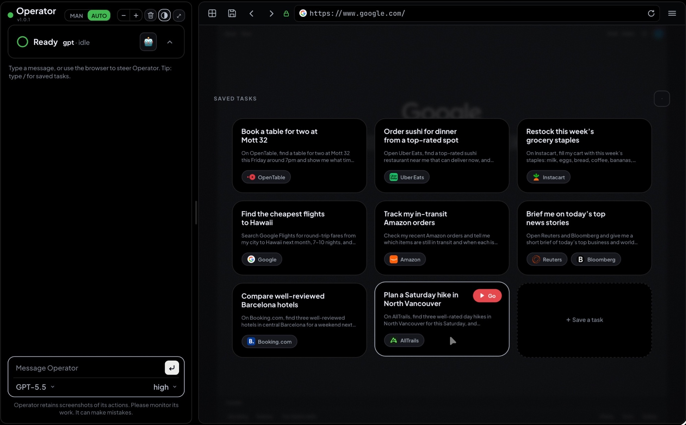

<h1>Operator</h1>
<p><b>Computer-Using Agent</b></p>

<p>
  
  
  
  
</p>

<p>
  
</p>

<p><sub><i>Operator's agent playing RuneScape Classic (OpenRSC) live — left: the interleaved thinking + action trace (“We're fighting!” → Clicking → “Rat is dead!”) reasoning over what it sees on the canvas; right: the actual game it's driving, streamed frame-by-frame. The agent reads the canvas by screenshot and clicks by pixel coordinate — no DOM to rely on.</i></sub></p>

<p align="center"><sub><i>More: <a href="docs/img/operator-geoguessr.jpeg">reasoning through a live GeoGuessr round</a>.</i></sub></p>

<p>
  
</p>

<p><sub><i>The saved-task launchpad — one-tap tasks on the idle stage, each pinned to the sites it uses. Hit <b>Go</b> and the prompt dispatches straight to the agent.</i></sub></p>

---

A live **browser / computer-use agent cockpit**. Watch a real Chrome in real time, steer it manually, or hand control to a subscription-backed agent — Claude, GPT, or Gemini — that drives the browser and reports back.

> **Inspired by OpenAI's Operator.** This project borrows the name and the spirit of a watch-the-agent-drive interface. It is an independent implementation, not affiliated with, endorsed by OpenAI, or derived from any OpenAI products.

> **MIT licensed** — free to use, modify, and distribute. See [`LICENSE`](LICENSE).

---

## Quickstart

```bash
git clone https://github.com/jeffbai996/operator
cd operator
./start.sh                    # → open http://127.0.0.1:5005
```

One script does everything: venv + deps, launches the automation Chrome
(sign into your sites in that window, once), reports which agent runtimes and
surfaces it found, and serves the cockpit. Idempotent — re-run it any time.
No required config; `.env.example` documents the optional knobs.

<details>
<summary>Manual steps (what start.sh does)</summary>

```bash
pip install -r requirements.txt
cp .env.example .env          # optional — defaults are fine
bash browse/chrome-attach.sh  # the browser the agent drives (logged-in, separate profile)
python app.py                 # open http://127.0.0.1:5005
```
</details>

**Agent runtime — bring your own subscription** (no metered API key, the cheap path):
- **Claude** — install the `claude` CLI and `claude login` (creds in `~/.claude`)
- **GPT** — install the `codex` CLI and sign in (creds in `~/.codex`)

Operator detects whichever you have and drives the browser with it. An API-key
fallback is documented in `.env.example`, but driving a browser over the API is
expensive (a screenshot per step) — the logged-in CLI path is strongly preferred.

> **Status:** **v1.0.26** — highlights since v1.0.20: the full-viewport splash
> homepage with a flash-free collapsed boot, restored-session wiring that can't
> paint an inert cockpit, chat-style auto-resizing composers, viewport
> self-repair, and a visible-browser contract — cockpit runs refuse the silent
> headless fallback, so the agent always drives the browser the feed shows.

## What it does

| | |
|---|---|
| **Live view** | Self-clocking frame pump of an attached Chrome via CDP `Page.captureScreenshot` — latency bounded at ~1 frame in flight on any device, with an adaptive `lo` tier (downscale + harder JPEG) for small screens and Save-Data connections. |
| **Manual steer** | Click / type / scroll / press-hold / drag flow straight through to the page. |
| **Agent drive** | `claude-a` + `claude-b` (Claude) and `gpt` (Codex), all on subscription auth — no metered API keys. Conversation is shared across bot switches and persisted across restarts. |
| **Trace** | Interleaved thinking + actions; commands and URLs render as code blocks, element targets as plain text; per-turn step counts; modern error blocks that surface the failure reason. |
| **UX** | MAN/AUTO modes, drag-to-resize chat, live font controls, mobile layout, launchpad of saved tasks, a `/` slash palette, and a real scheduler (repeat/time/day → cron). |
| **Reliability** | A serialized run state machine (a Stop can't be swallowed by a follow-up turn, a stall-kill can't mislabel a token-cap stop, a clean exit racing a stop is never "done"), a stall watchdog that ignores legitimate inter-turn gaps, a hardened stream parser that survives malformed runtime output, Chrome launched once at server boot, persisted scheduler dedupe, and an env-tunable token-cap governor. |
| **Surfaces** | Browser (default), an isolated sandbox desktop (Xvfb), or the real desktop (gated — explicit per-session confirm, panic-STOP always on screen). Switch from a popover on the brand mark; the live feed follows. |
| **Perception** | Zero-token local vision (`vision/`): template/colour-blob target finding + OCR, per-game region maps, and grid/crop grounding overlays — the agent reads labeled targets instead of squinting at raw pixels. |
| **game_macro** | A planner/controller split (`control/`): the model emits a multi-step macro once, a local controller executes + verifies it at machine speed with zero mid-macro model calls, and only reports back on completion or surprise. |

---

## Layout

```text
__init__.py               exports bp (Flask blueprint) + runner (AgentRunner)
operator_view.py          blueprint: streamer (CDP screenshots) + /operator routes
operator_agent.py         AgentRunner: the run state machine (dispatch/stop/gate)
operator_runtimes.py      per-runtime launch adapters (argv + MCP-config ownership)
operator_prompts.py       personas, surface mandates, the task SYSTEM DIRECTIVEs
operator_trace.py         pure tool-event -> trace-label functions + text cleaning
operator_agy.py           Gemini/Antigravity trajectory parser (no event stream)
operator_tasks.py         saved-task store (name / prompt / bot / model / tools)
operator_schedule.py      cron matcher + background dispatcher, disk-persisted dedupe
operator_session.py       one shared cockpit session (rev-counted, cross-device)
operator_history.py       flight recorder: SQLite run ledger, one row per finished run
operator_steer.py         mid-run steer queue (cross-process, hook + exit-seam delivery)
steer_hook.py             PostToolUse hook: injects queued steers into the live agent
templates/operator.html   the UI markup + a small endpoint-config script
static/js/operator.js     the entire cockpit client (extracted from the template)
static/operator.css       the UI stylesheet (extracted from the template)
align_audit.py            dev tool: measures header / urlbar alignment
vision/                   local perception: template/colour targets, OCR, per-game maps
control/                  surface interface + game_macro controller + control MCP
computer-use/             sandbox (Xvfb) + real-desktop (PowerShell/WSL) backends
```

---

## Run

Standalone: `./start.sh` (or `python app.py`) serves the cockpit at `http://127.0.0.1:5005`. It also still works as a Flask blueprint — register `operator_view.bp` on any host app and serve it behind a reverse proxy / tunnel.

---

## Roadmap

**Sessions + conversation sidebar** — multiple conversations instead of the single shared session: a collapsible sidebar listing chats (rename / delete / switch), and "New chat" landing on the welcome view — the wordmark + composer launchpad. The header's launchpad button (return-to-splash, mid-conversation included) is the seed of this surface.

**v1.1 — perception depth + the canvas-game showcase**
- Self-hosted OpenRSC demo (zero ToS risk) — the flagship RuneScape-class canvas run.
- Sprite-capture workflow: lift template sprites from live frames into `vision/maps/`.
- Map auto-calibration: derive region geometry from perception (blob grids) instead of static seed coordinates, so maps survive layout/viewport changes.
- Desktop + macro combined: `game_macro` on the sandbox desktop — grind a native app the way a canvas game is ground.
- OCR in anger: system tesseract, text conditions and chat/tooltip reading in real macros.

**v1.2 — continuity**
- Long-lived controller sessions: controller state and watchers persist across `game_macro` calls; events push to the planner instead of being polled.
- Auto-replan loop: on a macro yield the planner re-decides and continues under a hard step/token budget — sustained autonomous play sessions.
- ~~Driver parity~~ — shipped early, in v1.0.1.

**Explicitly not planned**: twitch-reflex games (physics, not skill — a different control layer), and the real desktop as a default anything — it stays confirm-gated with STOP on screen.

## Changelog

**v1.0.26** — **flash-free splash boot + the agent drives the browser you're watching**. The welcome splash now ships pre-collapsed in the markup itself, so a page refresh paints the calm wordmark-and-composer assembly directly instead of flashing the category tabs and card grid for the beat before the post-paint JS collapse landed. And a new cockpit contract kills the invisible-browsing failure mode: launch adapters set `OPERATOR_REQUIRE_CDP=1`, so when the feed's Chrome is unreachable the Playwright MCP fails loudly instead of silently falling back to a headless browser the live view never shows — the agent reports the browser down, which is the truth. The sandbox desktop also moves from XGA to a compact 960×768 (5:4) viewport that fits tall and high-zoom cockpit layouts better while keeping the coordinate scale the model's click grounding is calibrated for.

**v1.0.25** — **restored-session wiring + composer auto-resize**. The launchpad lifecycle separates into wiring, rendering, and visibility layers: control wiring always runs, so a device restoring a cached conversation boots a live cockpit with a working HOME/reopen path instead of a painted, inert splash (the old nonempty-log guard returned before any listeners attached; init failures were also swallowed by blind catches — they surface on the console now). Both composers auto-resize like a chat, including a scale-aware pill on coarse-pointer WebKit that grows per painted line to a ~9-line cap before scrolling. Polish: the trash lands on the solid splash, category pills gain clearance from their scroll row's clip edge, fullscreen panel margins tighten, and the schedule picker's empty state reads "None".

**v1.0.23** — **splash, viewport, and composer polish**. Separate top-right theme and close controls return, steering hints hide while the splash owns the screen, and light mode replaces gray blocks with white surfaces and softer card borders. The splash paints before session state restores, launchpad controls initialize independently from model discovery (a slow backend can't leave cards, pills, or close inert), click-away collapse uses a compact 24px halo around the card block, and both composers expand through useful multiline drafts before scrolling. Asset cache revisions are independent from the displayed release so long-lived tabs can't retain stale styling.

**v1.0.22** — **viewport recovery + launchpad polish**. Browser targets retain a persistent desktop-metrics session, switched tabs reassert it, and capture self-repairs collapsed viewports instead of rendering a blank or mobile-width frame. The launchpad gets quieter crossfades, stable search/refresh/add ordering, clearer Browse/Food/Local/Shop/Travel/Research/Media categories, and a Saved source with a minimal empty state.

**v1.0.21** — **true homepage state**. The fresh-session splash owns the full viewport with no chat rail, resize gutter, site header, browser chrome, or empty-cockpit escape hatch; the first submitted task reveals the complete interface in one transition.

**v1.0.20** — **the real-desktop input boundary, fixed for good**. WSL-interoped PowerShell can *capture* the interactive session but Windows silently denies its window-station *input* writes (`SetCursorPos` returns false — clicks vanished without an error). Input now crosses a per-user `InteractiveToken` Task Scheduler broker (`computer-use/install-win-input-broker.ps1` — no elevation, no service), rejected actions fail loudly instead of silently, and desktop-real dispatch pre-flights both capture and broker health. The automation Chrome learns the same trick: launched via an interactive scheduled task, so a watchdog relaunch lands on the real desktop instead of a session-0 void where the window clamps to a 1024×768 virtual display and single-instancing poisons every later manual open. Plus: the demo-badge regex accepts bare version strings (a hardcoded `v` prefix silently ate the " demo" suffix), chat input and placeholder re-proportioned to the model picker, saved-task card titles get a smaller face and a longer run before the ellipsis.

**v1.0.19** — **viewport geometry + browser chrome**. Scrolled CDP captures now follow the live viewport instead of recording the blank document region above it (the "giant white band" on any scrolled page), the demo browser returns to a landscape frame, touch scrolling follows touchscreen convention without native stage overscroll, and the URL brow regains its full-height proportions.

**v1.0.0** — **full hands-off computer-use — perception, game_macro, desktop surfaces**. This fulfills the `v1.0.0` promise: the agent can now drive **three surfaces** — the logged-in browser (as before), an **isolated sandbox desktop** (Xvfb — nothing outside it can be touched), and the **real desktop** (gated: never the default, needs an explicit per-session confirm, panic-**STOP** always on screen). Switch from a popover on the brand mark; the live feed follows whichever surface is active, mid-session, no reconnect. **Local perception** (`vision/`): a `perceive` tool grounds the agent in labeled on-screen targets without a single extra model call — template + colour-blob matching, OCR text extraction, per-game region maps (Lichess, OpenRSC shipped), and an optional coordinate grid or region-crop overlay for when raw pixels are still the fastest read. **game_macro planner/controller split** (`control/`): instead of one LLM round-trip per click, the model emits a multi-step macro once — click-by-target-label, waits on local conditions, repeats — and a local controller executes and verifies it at machine speed with **zero mid-macro model calls**, bailing back to the planner only on completion or genuine surprise. **Trace integration**: every macro op and perception call streams into the same live action trace as browser tool calls, so a desktop run reads exactly like a browser one — thinking interleaved with what actually happened on screen.

<details>
<summary><b>Earlier 1.0.x releases</b> (v1.0.1 – v1.0.18)</summary>

**v1.0.18** — **iOS keyboard geometry**. Visual-viewport tracking pins the input sheet above the software keyboard, removing the per-keystroke caret-pan fight.

**v1.0.17** — **runtime + mobile reliability**. First-turn watchdog birth race fixed, cold-state polling stops the signal-lost strobe, Codex MCP environment compatibility restored, and the mobile sheet gains a feed-fit detent.

**v1.0.16** — **the fix release closing the 1.0.x line**. Demo/prod store isolation (a demo visitor's mid-run steer could reach a live production run — found in review, fixed at the launch layer with code backstops), Win-key hotkeys via `keybd_event` (SendKeys silently dropped the Win modifier — "switch virtual desktop" sent Ctrl+Right into the void), sandbox latency back to browser-level (a stale X lock silently wedged container restarts; the boot script self-heals now), the trash button pushes the cleared session (the server used to resurrect the chat), a smooth Finish-up hand-back flow, the surface chip sheds size on narrow rails instead of colliding with the mode toggle, red-✕/green-✓ consent pills, and the desktop taskbar auto-minimizes to icons when idle.

**v1.0.15** — **run economics + trace replay**. A live token meter on the working card (the ledger's burn numbers while the run burns), and History rows expand on click into the full role-tagged trace. A run queue was deliberately *not* built: the single-flight runner is a safety property, and mid-run steering already answers "message while busy".

**v1.0.14** — **the JS extraction + PWA**. The ~3,600-line inline cockpit script became `static/js/operator.js` — extracted mechanically (scripted cut with abort-on-surprise guards), endpoints injected via a tiny inline config so the client file is plain JS: cacheable, lintable, `node --check`-able. Plus install-to-home-screen: a web manifest with relative scope (works under any mount path), generated icons, standalone meta — the cockpit installs as an app on a tablet.

**v1.0.13** — **task templates + re-run**. Saved-task prompts take `{{variables}}`, filled at dispatch — an unfilled run bounces with the missing names, and Go loads the prompt into the composer with the first placeholder selected. Scheduled tasks refuse variables at save (nobody is there to fill them when cron fires). History rows get ↻ run-again carrying the row's own agent/model/surface, and the real desktop still demands its consent flow.

**v1.0.12** — **mid-run steering**. A message sent during a live run now *reaches the agent* instead of killing it. Two delivery seams: a PostToolUse hook injects the message right after the agent's next tool call (mid-loop, via resume-safe project settings), and anything unconsumed becomes one more resumed turn when the process exits — so delivery is guaranteed on every runtime. The composer soft-steers with queued→delivered feedback; Stop stays the hard redirect.

**v1.0.11** — **one shared session + the flight recorder**. The cockpit chat/mode/pickers live server-side now — open the cockpit on another device and the conversation is just there. And every finished run writes one row to a SQLite ledger (who ran what, where, how it ended, token spend, the full trace) surfaced in a History popover. The real-desktop dispatch pre-flights the screen and refuses a locked console instead of clicking into a void.

**v1.0.10** — **the client harness + feed truth**. A headless-Chromium page harness now loads the REAL cockpit page and fails on any `pageerror` — the class of client-side init crash that server tests can't see (and it has caught real bugs every release since). Placeholder frames no longer count as live signal (kills a reconnect word-flap), the streamer's browser driver is stopped on every exit path with relaunch backoff (an orphaned-driver leak), and finished runs sweep any leftover viewport emulation off the browser.

**v1.0.9** — **the runner decomposed**. `operator_agent.py` (2,450 lines) is now a 1,250-line state machine plus focused modules: per-runtime **launch adapters** (`operator_runtimes.py` — each owns its argv + MCP-config write, pinned by exact-argv tests and byte-parity prompt fixtures), the **Gemini trajectory subsystem** quarantined into `operator_agy.py` (agy emits no event stream — the live trace is reverse-engineered from its on-disk trajectory; the extraction is proven by fixture replay), and a **hardened stream parser**: truncated JSON, non-dict events, `content: null`, string-typed usage blocks — none of it can kill the reader thread and wedge a run anymore.

**v1.0.8** — **adaptive frame tier + a snappier feed**. The feed takes `?tier=lo|hi`: small screens and Save-Data connections get downscaled, harder-compressed frames (~35% of the bytes on a busy page — measured, not vibes) while desktop keeps full quality; the sandbox stream drops to a leaner ffmpeg rate on `lo`. A cockpit input action now **wakes the capture loop immediately**, so the click's result paints within a frame instead of up to a full interval later (idle cadence unchanged). Under the hood: the prompt prose (~28KB of personas + directives) moved to `operator_prompts.py` with **byte-identical** output proven by pre-refactor fixtures, trace labeling moved to `operator_trace.py`, and a real bug died: the cron matcher ANDed day-of-month with day-of-week, so `0 9 1 * 1` ("the 1st, or any Monday") almost never fired — standard cron ORs them; now it does too.

**v1.0.7** — **the run state machine goes correctness-first**. Four confirmed races fixed: the status poll iterating `messages` while the run thread appends (intermittent 500s under any active run — reads now copy under the lock); the stall watchdog SIGTERMing a healthy run in the inter-turn completion-gate gap; a user Stop during that gap being silently swallowed by the follow-up turn's state reset (a separate cancel flag that only a new dispatch clears); and terminal-reason races (token-cap vs stall vs stop vs clean-exit) resolved by one deterministic priority, so a run can never end mislabeled "done" when it was actually stopped.

**v1.0.6** — **the launchpad grows up**. **Search** across saved tasks and examples (always-on magnifier next to refresh, AND-across-words over name/prompt/sites, Escape to clear); the card grid **auto-cycles every 15s** with a smooth cross-fade (pauses on hover, while searching, and when the tab is backgrounded; honors reduced-motion); **12 new example tasks** on fresh services, wired into the Save-task suggestions too.

**v1.0.4–1.0.5** — **reliability stretch + model refresh**. A **server-side stall watchdog** (soft "stalled" signal → hard auto-stop with the reason in the trace) plus a runtime-agnostic **repeat-action loop-breaker** (N identical actions → a one-shot warning + a next-turn corrective nudge); a **completion gate** — a clean exit without recent visual evidence, or one that reads like a bail, gets exactly one verify/replan follow-up turn; **auto-look on failed clicks** (a zoomed crop + OCR text with coordinates lands in the same tool result, so the model re-aims instead of re-guessing); the **self-clocking frame pump** (fetch → render → fetch: a slow client can never queue behind the feed, killing the progressive iPad lag); launchpad example cards with tap-to-load; GPT **5.6 Sol/Terra/Luna** in the picker with per-tier effort ladders.

**v1.0.3** — **the sandbox becomes a usable computer**. **File transfer**: a Transfer control on the desktop taskbar sends files into the container's `~/Downloads` and downloads anything the agent saves to `Downloads` / `Desktop` / `Documents` (whitelisted dirs only, traversal-proof path gate, 200MB cap, disabled on shared demo instances). **Persistent home**: `/home/opuser` now lives on a named Docker volume, so an image upgrade keeps your files — only the two-tap Delete factory-resets (it removes the volume too). **A real app set**: LibreOffice Writer/Calc, PDF viewer (Atril), archive manager, image viewer, calculator, nano, plus `curl`/`wget`/`git`/`unzip`/`python3` in the terminal. The agent is told where the exchange dirs are, so "save the report where I can grab it" just works.

**v1.0.2** — **the sandbox looks and feels like a computer**. The container desktop is now a **full XFCE4 session** (Greybird theme, app menu, window-list panel, wallpaper, Thunar/Mousepad/Ristretto/galculator) instead of a bare openbox + tint2 shell. And the feed/input latency got attacked at the root: the live feed is now **one long-lived ffmpeg MJPEG pipe** out of the container (~7–8 fps JPEG) instead of a scrot + two `docker exec`s per frame (~1 fps of heavy PNGs), and manual-steer input goes down **one persistent shell pipe** with an ack handshake instead of a fresh `docker exec` per action — warm steer round-trips dropped from ~130–210ms to **~5ms**. (Older images without ffmpeg fall back to the scrot path automatically.)

**v1.0.1** — **the sandbox grows up: a real Docker desktop, manual steer, and driver parity**. The sandbox surface is now a **persistent Docker container** (Xvfb → openbox → taskbar → Chromium already open at boot) instead of a host Xvfb — nothing outside the container can be touched, it survives restarts, and only an explicit Delete destroys it (the feed auto-provisions a fresh one after). It runs at **1024×768 (XGA)** — the resolution vision-model click grounding is calibrated around — with the **mouse pointer drawn in every frame**, so the agent can *see* where its cursor landed, measure a miss, and correct it instead of re-guessing (plus click-precision and date-picker directives that encode exactly that tactic). One **virtual desktop only**: stock openbox ships four, and a stray wheel-scroll on the root window silently switched — every open app "vanished" mid-run. **Desktop taskbar**: on desktop surfaces the browser URL bar collapses into a taskbar — app launcher (Chromium / Terminal / Files), the game-map picker's new home, container Restart, and a two-tap Delete. **Manual steer on desktop surfaces**: full manual interaction — click/double/triple, **right-click** (ported to the browser surface too, via CDP), drag, scroll, typing and key chords, and **live hover streaming** (move your pointer over the feed and the container's cursor tracks it). **Driver parity, pulled forward from the roadmap**: the operator-control MCP now wires itself into the GPT (Codex) and Gemini (Antigravity) runtimes at dispatch, so desktop surfaces and `game_macro` are no longer Claude-only. **Activity tab-follow**: the live view follows the tab the agent is *driving* (URL-change detection, not visibility polling — CDP-driven tabs never report visible), gated on a live run so it can't steal focus while a human steers. **Clean desktop trace labels**: `computer`/`perceive`/`game_macro` calls read like browser ones — "Clicking (512, 384)", "Reading the screen", "Running macro · 4 steps". **Launchpad polish**: example task cards on fresh installs; **Go is the only launch trigger** (tapping elsewhere on a card is inert); X-only dismiss with a real touch-size target; overlay scroll no longer leaks to the page on iOS. **Inline screenshots**: agent-posted screenshots from any runtime render as image cards in the chat with a lightbox zoom (file-path links from non-Claude runtimes included), and chat code blocks word-wrap instead of sideways-scrolling. **One-command onboarding**: `./start.sh` — venv, deps, the automation Chrome, runtime/surface detection, serve.

</details>

<details>
<summary><b>Older releases</b> (v0.1 – v0.9)</summary>

**v0.9.0** — **coordinate contract + hardening**: locked down the device-px→CSS-px scale conversion across the surface stack (unconverted clicks landed down-right on any DPR>1 window); `control/README.md` documents the planner/controller split + safety model; a launch-error path that used to die silently now surfaces a real error in the chat.

**v0.8.0** — **the surface axis**: dispatch now takes a **surface** — `browser` / `desktop-sandbox` / `desktop-real` — routed through a dedicated **control MCP** (`computer` / `perceive` / `game_macro`). Surface picker in a popover off the brand mark (`desktop-real` needs a two-step confirm every session); the live feed switches source with the surface; a **panic STOP** arms a shared kill-switch file whenever a desktop run is live.

**v0.7.2** — **stability + UI polish**: Chrome launches exactly once at server boot (no more duplicate-window races); scheduler fired-keys persisted to disk (atomic tmp+replace); vision lazy-imports `pytesseract`; stylesheet extracted to a served `static/operator.css`; 1Password autofill hint.

**v0.7.1** — intermediate infra tag (folded into v0.7.2): scheduler persistence, CSS extraction, single-boot Chrome, lazy OCR, env-tunable token-cap governor.

**v0.7.0** — **saved tasks + run governor**: OpenAI-Operator-style **saved tasks** — a **/ slash palette**, a Save-task modal (name / prompt / tools-and-sites pill field), and a **launchpad** of task cards on the idle stage. Optional 5-field **cron schedule** per task (background dispatcher, per-minute dedupe) feeds an unseen-runs counter. **Run governor**: per-run token caps that auto-stop a runaway vision task, plus an image governor that downscales oversized screenshots before ingest. Plus drag-to-reorder tabs, per-tab favicons, nav status dot.

**v0.6.8** — **mobile polish + reliability**: model/effort pickers no longer clip long names; a dead run no longer wedges future dispatches (liveness verified, reset force-clears); Gemini live trace locks onto the run's own trajectory file; clicks go through a raw CDP input dispatch that can't wedge the frame lock; scroll-up fixed (steer endpoint was dropping wheel-delta). Sonnet → **Sonnet 5**.

**v0.6.7** — **trace + streaming polish**: Gemini/Antigravity steps stream live; status card reads Ready/Connecting by live-browser state; gpt-oss harmony reasoning tokens stripped; agent sessions isolated from the interactive list.

**v0.6.6** — **reliability + cost**: clean interrupt handling (Stop → "Interrupted", no phantom error); orphaned browser-tool process reaped; screenshot-economy directive + per-turn token guard; "Reconnecting" state instead of a false "Ready" over a dropped feed.

**v0.6.5** — **inline agent screenshots**: agent-reported screenshots render in the chat (guarded `/operator/shot/<name>` route — basename-only, extension whitelist, traversal-safe); Gemini's Playwright MCP is stripped back out of the global config after each run; trace shows what a tool acted on (`Searching ("the terms")`, paths, commands).

**v0.6.2** — **third driver**: a **Gemini** driver (Antigravity CLI, subscription-backed); coordinate gesture tools for canvas/board UIs; markdown + code-block backgrounds; assorted post-Stop / label fixes.

**v0.5.9** — **smarter agent**: sharper computer-use prompt (act→wait→continue, vision fallback, scroll-to-find, never repeat a failed action, pixel-click cookie banners); prompt-injection guard (page content is data, not orders); stuck-loop backtracking; vision-click accuracy fixed in attach mode.

**v0.5.8** — **control row + responsive header**: header controls on one aligned row; the chat rail drags narrow and the header sheds chrome via container queries (the wordmark smoothly collapses).

**v0.5.7** — **Finish-up hand-back**: after a Take-control hand-off, a *Finish up* pill hands control back (optional note), resuming where the agent left off. Plus clickable trace URLs, back/forward no longer stalls the feed.

**v0.5.6** — hand-off polish: no redundant done-line under a hand-off card; traffic-light status dot; held arrow keys scroll continuously; ×N repeat badge as a circular pill.

**v0.5.5** — **Take control** hand-off: at a human-only gate (captcha, 2FA, password login, payment/confirm) the agent surfaces a *Take control* card instead of brute-forcing it. **Verify-after-action** (re-check the page after each consequential action), a running numbered plan, and coalesced duplicate trace lines.

**v0.5.3** — native coordinate mouse tools (`browser_mouse_drag_xy` etc.) for board/canvas games; `browser_pdf_save`; held-key navigation; interrupt-steer closes the turn as "Steered after Xs".

**v0.5.2** — interrupt-steer: a mid-run message stops the turn and redirects immediately (instead of queueing); the −/+ control scales the whole chat box.

**v0.5.1** — fixed a JS temporal-dead-zone crash that halted page scripts on load (feed stuck "Connecting" while the server was fine); idle status shows the selected driver; no reply duplication on refresh.

**v0.5.0** — runtime documented + generalized: generic `claude` + `gpt` drivers, both BYO-subscription; config via env; `.env.example` + Quickstart.

**v0.4.1** — vendored a cross-platform Chrome harness (`browse/chrome-attach.sh` on macOS / Linux / Windows / WSL; `browse/playwright-mcp.sh` wires the Playwright MCP to it).

**v0.4.0** — standalone app: `app.py` + base template + `requirements.txt`, so it runs on its own instead of needing a host Flask app.

**v0.3.8** — major mobile + reliability pass: mobile bottom-sheet redesign (draggable peek/half/full over a full-screen browser); focus no longer zooms the viewport; screenshot-by-default-or-real-pixels agent vision; present-continuous status card; static-page frame-dedup (~0.5fps heartbeat) for battery/data.

**v0.3.7** — scroll-through (wheel + iPad swipe); status-card minimize to a pill; red error ring; tighter code blocks.

**v0.3.6** — per-message hover timestamps; edit/retry the last prompt; animated status subline; "Starting up…" on launch.

**v0.3.5** — tab UI: close button, open/close animations, live view follows the agent into a new tab.

**v0.3.4** — sliding MAN/AUTO segmented control (persists across refresh); restored the collapsible in-flight trace head.

**v0.3.3** — agent cursor (smooth CDP-captured glide); browser zoom + back/forward chrome; URL bar Google-searches non-URL input.

**v0.3.2** — manual-mode card redesign; convo dims rather than clears in MAN; mobile bottom-sheet chat; theme toggle.

**v0.3.1** — trace fences commands + URLs only; stderr surfaces a specific failure reason; license/README split to this repo.

**v0.3.0** — Operator version label; markdown fixed (fenced blocks, auto-linked URLs); trace step-count header.

**v0.2.x** — drag-to-resize chat; mobile scroll + capped height; iOS focus-zoom fix; clicks on eval-disabled sites via CDP.

**v0.2.0** — multi-driver on subscription auth; shared cross-bot transcript persisted across restarts; browser-first behavior.

**v0.1.x** — feed hardening (flicker-free, wedge auto-recovery, SIGNAL-LOST overlay); status card; MAN/AUTO; per-action emoji trace.

**v0.1.0** — initial live browser stream (CDP MJPEG) + manual steering.

</details>
